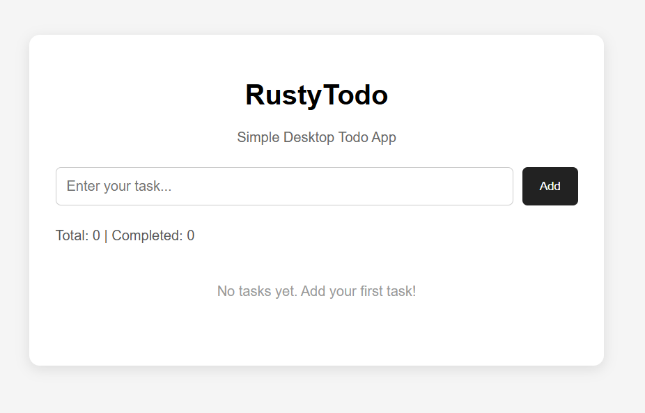
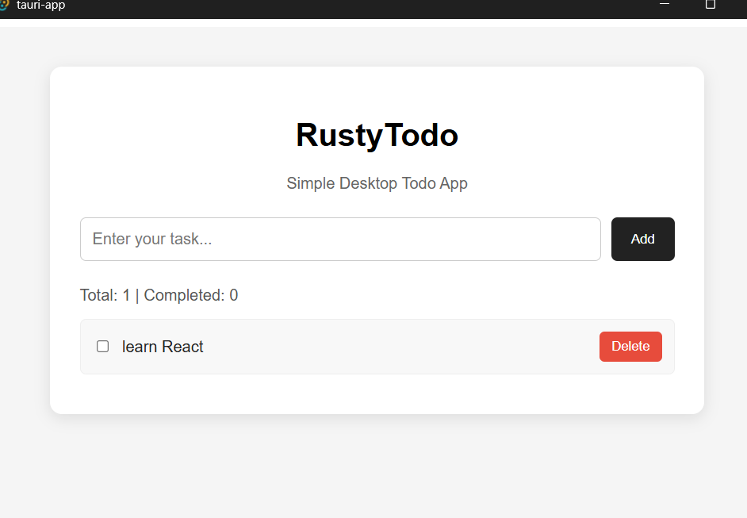
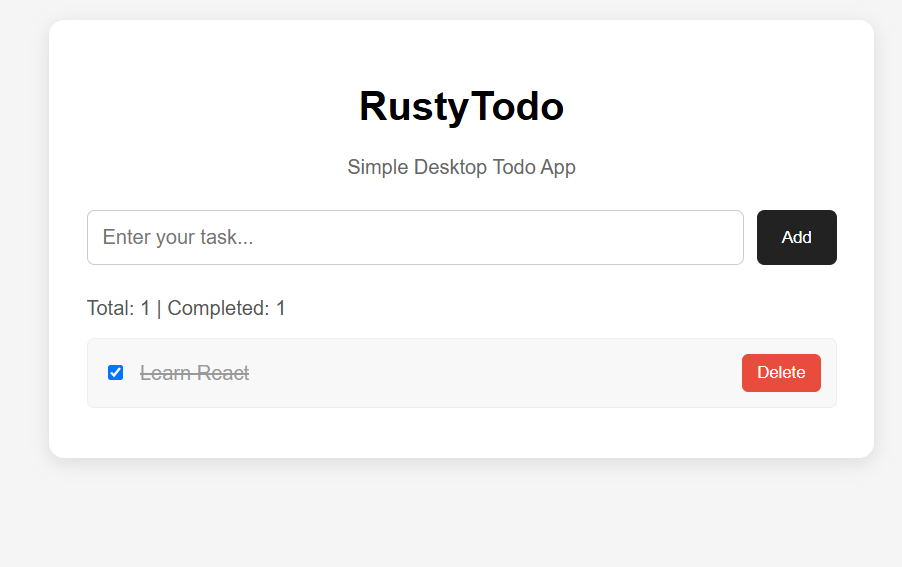

# 📝 RustyTodo

A simple and lightweight desktop Todo application built using **React, Tauri, and Rust**.

RustyTodo allows users to add, complete, delete, save, and automatically load their daily tasks.

---

# 🚀 Features

- ➕ Add new tasks
- ✅ Mark tasks as completed or uncompleted
- 🗑️ Delete tasks
- 📊 View total task count
- 📊 View completed task count
- 💾 Save tasks locally
- 🔄 Automatically load saved tasks when the application starts
- 🖥️ Desktop application using Tauri
- 🦀 Rust-based local file handling

---

# 🛠️ Tech Stack

| Technology | Usage |
|---|---|
| React | User Interface |
| JavaScript | Frontend Logic |
| Tauri | Desktop Application Framework |
| Rust | Backend and File Operations |
| JSON | Local Task Storage |

---

# 🏗️ Project Architecture

```text
                    RUSTYTODO
                        │
                        ▼
                 ┌─────────────┐
                 │    React    │
                 │     UI      │
                 └──────┬──────┘
                        │
                    invoke()
                        │
                        ▼
                 ┌─────────────┐
                 │    Tauri    │
                 │   Bridge    │
                 └──────┬──────┘
                        │
                        ▼
                 ┌─────────────┐
                 │    Rust     │
                 ├─────────────┤
                 │save_tasks() │
                 │load_tasks() │
                 └──────┬──────┘
                        │
                        ▼
                   tasks.json
```

---

# ⚙️ How It Works

## Add Task

```text
User enters task
        ↓
React addTask()
        ↓
Update tasks state
        ↓
saveTasks()
        ↓
invoke("save_tasks")
        ↓
Tauri
        ↓
Rust save_tasks()
        ↓
Save data in tasks.json
```

## Load Tasks

```text
Application starts
        ↓
React useEffect()
        ↓
loadSavedTasks()
        ↓
invoke("load_tasks")
        ↓
Tauri
        ↓
Rust load_tasks()
        ↓
Read tasks.json
        ↓
Return saved tasks
        ↓
Display tasks on screen
```

---

# ▶️ Installation

## 1. Clone the Repository

```bash
git clone https://github.com/ayushkusingh69/Rust-Todo-app.git
```

## 2. Go to the Project Folder

```bash
cd tauriapp
```

## 3. Install Dependencies

```bash
npm install
```

## 4. Run the Application

```bash
npm run tauri dev
```

---

# 📂 Folder Structure

```text
tauriapp/
│
├── src/
│   ├── App.jsx
│   └── main.jsx
│
├── src-tauri/
│   ├── src/
│   │   └── lib.rs
│   │
│   ├── Cargo.toml
│   └── tauri.conf.json
│
├── assets/
│   ├── home.png
│   ├── tasks.png
│   └── completed.png
│
├── package.json
├── package-lock.json
└── README.md
```

---

# 📸 Screenshots

## Home Screen



## Tasks Added



## Completed Task



# 👨‍💻 Author

**Ayush Kumar Singh**